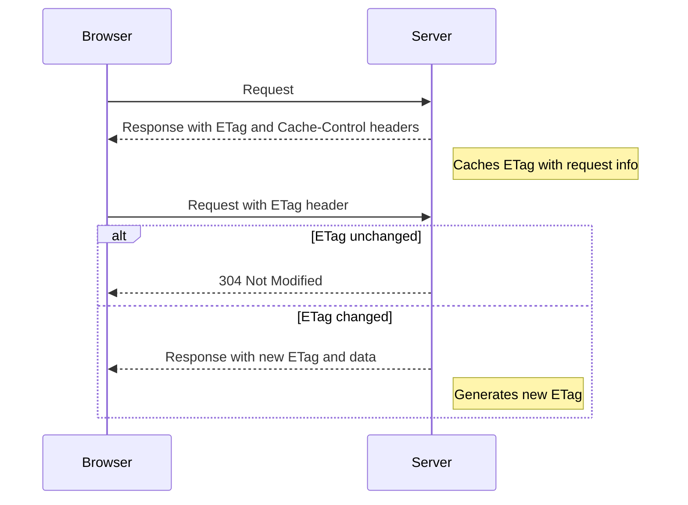

# Ocelot ETag Caching

## Basic

The Ocelot ETag Caching library adds support for ETag caching to the Ocelot API Gateway.
ETag caching is a mechanism that allows a client to cache data and the next time the same data is requested,
the client can verify that the data is still up to date. If the data is still current, the server will return a status
of `304 Not Modified` and the client will use the cached data. If the data is not up-to-date,
the server returns the data and the client caches it.

The idea is that the server adds two important headers to the response:

- `ETag` - data identifier (randomly generated value)
- `cache-control` - identifier that the data can be cached. Contains only the value `private` (⚠️ beware it must not be `public`, because then the data can remain cached anywhere.) It also does not contain `max-age` because in this case the client would not verify the data on the server (for a given amount of time. Occasionally this may be OK).

If the client (browser) finds these two headers in the response, it adds the `If-None-Match` header with the `ETag`
value in the next request to the server with the same path and the server knows if the data is still up to date
based on this value. If they are up to date it returns a status of `304 Not Modified` and the client uses the data from the cache.
**👌 The server does not send the data. This saves resources and bandwidth**

On the client, this works automatically because this behavior is defined in the HTTP specification (no need to do anything).



## Implementation

The implementation is based on Ocelot middleware. All caching will be done in this middleware and nothing
will be needed on the service side. The data itself is not cached, but only its identifier (ETag), 
based on which the data is verified to be up-to-date.

We use `IOutputCacheStore` to store ETags and invalidate them.

## Get started

### Ocelot configuration

```json
{
    "Routes": [
        {
            "Key": "getAllProducts",
            "DownstreamPathTemplate": "/api/producsts/",
            "UpstreamPathTemplate": "/products/",
            "CachePolicy": "getAllProducts",
            ...
        },
        {
            "Key": "getProduct",
            "DownstreamPathTemplate": "/api/producsts/{id}",
            "UpstreamPathTemplate": "/products/{id}",
            "CachePolicy": "getProduct",
            ...
        },
        {
            "Key": "deleteProduct",
            "DownstreamPathTemplate": "/api/producsts/{id}",
            "UpstreamPathTemplate": "/products/{id}",
            "InvalidateCachePolicy": "invalidateProductCachePolicy"
            ...
        }
    ]
}
```

### `Program.cs` configuration

```csharp
builder.Services.AddOcelotETagCaching((c) =>
    {
        // 👇 Add ETag caching policies
        // 👇 Simple policy with Expire and tag templates
        c.AddPolicy("getAllProducts", p =>
        {
            p.Expire(TimeSpan.FromMinutes(5));
            p.TagTemplates("products:{tenantId}", "all", "tenantAll:{tenantId}");
        });

        // 👇 Policy with custom cache key, etag generator and custom cache control
        c.AddPolicy("getProduct", p =>
        {
            p.Expire(TimeSpan.FromMinutes(5));
            p.TagTemplates("product:{tenantId}:{id}", "tenant:{tenantId}:all", "all");

            p.CacheKey(context => context.Request.Headers.GetValues("id").FirstOrDefault()); // 👈 Custom cache key
            p.ETag(context => new($"\"{Guid.NewGuid()}\"")); // 👈 Custom etag
            p.CacheControl(new() { Public = false }); // 👈 Custom cache control
            p.StatusCode(222); // 👈 Custom status code
            p.AddPolicy<MyCustompolicy>(); // 👈 Custom policy
        });

        // 👇 Policy with upstream cache key (based on original request before Ocelot transformation)
        c.AddPolicy("getProductUpstream", p =>
        {
            p.Expire(TimeSpan.FromMinutes(10));
            p.TagTemplates("product:{tenantId}:{id}");

            // 👇 Use upstream request for cache key generation
            p.UpstreamCacheKey(); // Uses default upstream key: method:scheme:host:path:query

            // 👇 Or use custom upstream cache key generator
            p.UpstreamCacheKey(request => $"custom:{request.Method}:{request.Path}");
        });
    }
);

...

app.UseOcelot(c =>
{
    // 👇 Add etag caching middleware
    c.AddETagCaching();
}).Wait();

app.Run();
```

## Cache Key Generation

The library supports two types of cache key generation:

### 1. Downstream Cache Key (Default)

By default, cache keys are generated from the transformed request after Ocelot processing (downstream request) using the format: `method:scheme:host:port:path:query` (normalized to lowercase).

You can customize the downstream cache key generation:

```csharp
p.CacheKey(downstreamRequest => $"custom:{downstreamRequest.Method}:{downstreamRequest.AbsolutePath}");
```

### 2. Upstream Cache Key (New)

Uses the original request before Ocelot transformation (upstream request):

```csharp
// Default upstream cache key (method:scheme:host:port:path:query)
p.UpstreamCacheKey();

// Custom upstream cache key generator
p.UpstreamCacheKey(request => $"upstream:{request.Method}:{request.Path}");
```

## Tag templates

Tag templates are used to create tag for cache entry. It is used to invalidate cache entries.
Tag is created by replacing placeholders with values from request route parameters.

For example, for route `/api/{tenantId}/products/{id}` and tag template `product:{tenantId}:{id}` the tag will be `product:1:2`.

## Cache invalidation

You can invalidate cache entries by tags defined in tag templates.

### Automatic by endpoints

```json
{
    "Key": "deleteProduct",
    "UpstreamHttpMethod": [ "Delete" ],
    "DownstreamPathTemplate": "/api/producsts/{id}",
    "UpstreamPathTemplate": "/products/{id}",
    "InvalidateCachePolicy": "invalidateProductCachePolicy", // 👈 Invalidate cache policy
}
```

```csharp
builder.Services.AddOcelotETagCaching(conf =>
{
    //...
    // define cache policy
    //...

    // 👇 Add invalidate cache policy
    conf.AddInvalidatePolicy("invalidateProductCachePolicy", builder =>
    {
        builder.TagTemplates("product:{tenantId}", "product:{tenantId}:{id}");
    });
});
```

### Manual

```csharp
public class ProductsService {
    private readonly IOutputCacheStore _outputCacheStore;

    public ProductsService(IOutputCacheStore outputCacheStore)
    {
        _outputCacheStore = outputCacheStore;
    }

    public async Task DeleteProduct(int tenantId, int id)
    {
        // 👇 Invalidate cache by tags
        await _outputCacheStore.InvalidateAsync($"product:{tenantId}", $"product:{tenantId}:{id}");
        // ...
    }
}
```

## Redis

By default is used `InMemoryCacheStore` but you can use `Redis` as well.

```csharp
builder.Services.AddStackExchangeRedisOutputCache(options =>
{
    options.Configuration = 
        builder.Configuration.GetConnectionString("MyRedisConStr");
    options.InstanceName = "SampleInstance";
});
```
